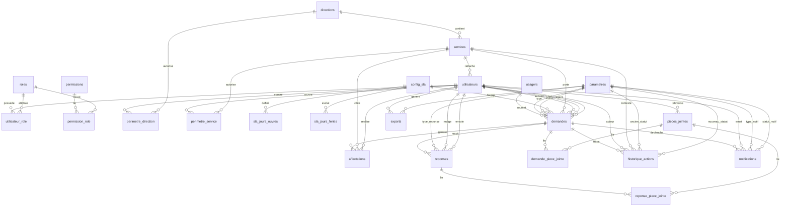

# Etat De La Base De Donnees

Date de mise a jour : 31/03/2026

## Vue d'ensemble

L'application utilise actuellement :

- `PostgreSQL`
- `Laravel 12`
- une base orientee autour du cycle de vie des `demandes`

Le coeur metier repose sur 4 blocs :

1. `Organisation et acces`
2. `SLA et calendrier ouvre`
3. `Gestion des demandes / reponses / pieces jointes`
4. `Tracabilite, notifications, exports`

## Tables metier principales

### Organisation et acces

- `directions`
  - PK : `id_direction`
- `services`
  - PK : `id_service`
  - FK : `id_direction -> directions.id_direction`
- `utilisateurs`
  - PK : `id_utilisateur`
  - FK : `id_service -> services.id_service` nullable
- `roles`
  - PK : `id_role`
- `permissions`
  - PK : `id_permission`
- `utilisateur_role`
  - PK composee : `id_utilisateur`, `id_role`
  - FK : `id_utilisateur -> utilisateurs.id_utilisateur`
  - FK : `id_role -> roles.id_role`
- `permission_role`
  - PK composee : `id_permission`, `id_role`
  - FK : `id_permission -> permissions.id_permission`
  - FK : `id_role -> roles.id_role`
- `perimetre_direction`
  - PK composee : `id_utilisateur`, `id_direction`
  - FK : `id_utilisateur -> utilisateurs.id_utilisateur`
  - FK : `id_direction -> directions.id_direction`
- `perimetre_service`
  - PK composee : `id_utilisateur`, `id_service`
  - FK : `id_utilisateur -> utilisateurs.id_utilisateur`
  - FK : `id_service -> services.id_service`
- `model_has_roles`
  - pivot Spatie pour le multi-role
- `model_has_permissions`
  - pivot Spatie pour permissions directes

### Parametrage

- `parametres`
  - PK : `id_parametre`
  - sert de catalogue pour :
    - type de demande
    - statut de demande
    - type de reponse
    - type de notification
    - statut de notification
    - formats d'export
    - autres familles parametrables

### SLA

- `config_sla`
  - PK : `id_config_sla`
- `sla_jours_ouvres`
  - PK : `id_sla_jour_ouvre`
  - FK : `id_config_sla -> config_sla.id_config_sla`
- `sla_jours_feries`
  - PK : `id_sla_jour_ferie`
  - FK : `id_config_sla -> config_sla.id_config_sla`
  - champs notables :
    - `date_ferie`
    - `date_fin` nullable

### Usagers et traitement des mails

- `usagers`
  - PK : `id_usager`
- `demandes`
  - PK : `id_demande`
  - UK : `numero_suivi`
  - FK : `id_usager -> usagers.id_usager`
  - FK : `id_type_demande -> parametres.id_parametre`
  - FK : `id_statut -> parametres.id_parametre`
  - FK : `id_config_sla -> config_sla.id_config_sla`
  - FK : `id_service_courant -> services.id_service` nullable
  - FK : `id_agent_accueil -> utilisateurs.id_utilisateur` nullable
  - FK : `id_agent_direction -> utilisateurs.id_utilisateur` nullable
  - FK : `id_agent_traitant -> utilisateurs.id_utilisateur` nullable
  - champs notables :
    - `objet`
    - `categorie`
    - `message`
    - `date_soumission`
    - `date_affectation`
    - `date_affectation_accueil`
    - `date_affectation_agent`
    - `date_reponse_direction`
    - `date_envoi_usager`
    - `date_cloture`
    - `heures_ouvrees_cloture`
    - `delai_alerte`
    - `alerte_accueil`
    - `alerte_chef`
    - `alerte_agent`
- `affectations`
  - PK : `id_affectation`
  - FK : `id_demande -> demandes.id_demande`
  - FK : `id_service -> services.id_service`
  - FK : `id_utilisateur -> utilisateurs.id_utilisateur`
- `reponses`
  - PK : `id_reponse`
  - FK : `id_demande -> demandes.id_demande`
  - FK : `id_type_reponse -> parametres.id_parametre`
  - FK : `id_redacteur -> utilisateurs.id_utilisateur`
  - FK : `id_envoyeur -> utilisateurs.id_utilisateur` nullable
  - UK metier : `id_demande + numero_version`
- `pieces_jointes`
  - PK : `id_piece_jointe`
  - FK : `id_uploadeur -> utilisateurs.id_utilisateur` nullable
- `demande_piece_jointe`
  - PK composee : `id_demande`, `id_piece_jointe`
  - FK : `id_demande -> demandes.id_demande`
  - FK : `id_piece_jointe -> pieces_jointes.id_piece_jointe`
- `reponse_piece_jointe`
  - PK composee : `id_reponse`, `id_piece_jointe`
  - FK : `id_reponse -> reponses.id_reponse`
  - FK : `id_piece_jointe -> pieces_jointes.id_piece_jointe`

### Tracabilite et suivi

- `historique_actions`
  - PK : `id_action`
  - FK : `id_demande -> demandes.id_demande` nullable dans l'etat actuel
  - FK : `id_utilisateur -> utilisateurs.id_utilisateur` nullable
  - FK : `ancien_statut_id -> parametres.id_parametre` nullable
  - FK : `nouveau_statut_id -> parametres.id_parametre` nullable
  - FK : `id_service_associe -> services.id_service` nullable
  - FK : `id_agent_associe -> utilisateurs.id_utilisateur` nullable
- `notifications`
  - PK : `id_notification`
  - FK : `id_demande -> demandes.id_demande`
  - FK : `id_type_notif -> parametres.id_parametre`
  - FK : `id_statut_notif -> parametres.id_parametre` nullable
  - FK : `id_emetteur -> utilisateurs.id_utilisateur` nullable
- `exports`
  - PK : `id_export`
  - FK : `id_utilisateur -> utilisateurs.id_utilisateur`
  - FK : `id_format_export -> parametres.id_parametre`

## Tables techniques Laravel

- `users`
- `password_reset_tokens`
- `sessions`
- `cache`
- `cache_locks`
- `jobs`
- `job_batches`
- `failed_jobs`

Ces tables existent pour le framework, mais le metier principal de l'application repose surtout sur `utilisateurs`, `usagers`, `demandes`, `reponses`, `historique_actions`, `services`, `directions`, `parametres` et `config_sla`.

## Relations et cardinalites

### Organisation

- `directions 1 -> N services`
- `services 1 -> N utilisateurs`
- `utilisateurs N <-> N roles` via `utilisateur_role` et `model_has_roles`
- `roles N <-> N permissions` via `permission_role`
- `utilisateurs N <-> N directions` via `perimetre_direction`
- `utilisateurs N <-> N services` via `perimetre_service`

### SLA

- `config_sla 1 -> N sla_jours_ouvres`
- `config_sla 1 -> N sla_jours_feries`
- `config_sla 1 -> N demandes`

### Traitement metier

- `usagers 1 -> N demandes`
- `parametres 1 -> N demandes` pour `id_type_demande`
- `parametres 1 -> N demandes` pour `id_statut`
- `services 1 -> N demandes` pour `id_service_courant`
- `utilisateurs 1 -> N demandes` pour :
  - `id_agent_accueil`
  - `id_agent_direction`
  - `id_agent_traitant`
- `demandes 1 -> N affectations`
- `services 1 -> N affectations`
- `utilisateurs 1 -> N affectations`
- `demandes 1 -> N reponses`
- `parametres 1 -> N reponses` pour `id_type_reponse`
- `utilisateurs 1 -> N reponses` pour `id_redacteur`
- `utilisateurs 1 -> N reponses` pour `id_envoyeur`
- `demandes N <-> N pieces_jointes` via `demande_piece_jointe`
- `reponses N <-> N pieces_jointes` via `reponse_piece_jointe`

### Suivi et audit

- `demandes 1 -> N historique_actions`
- `utilisateurs 1 -> N historique_actions`
- `services 1 -> N historique_actions`
- `parametres 1 -> N historique_actions` pour les anciens/nouveaux statuts
- `demandes 1 -> N notifications`
- `utilisateurs 1 -> N notifications`
- `parametres 1 -> N notifications`
- `utilisateurs 1 -> N exports`
- `parametres 1 -> N exports`

## Schema relationnel simplifie

## Points d'attention

- `historique_actions.id_demande` est maintenant nullable pour permettre des traces purement administratives.
- Le projet contient encore les tables Laravel standards (`users`, `sessions`, `jobs`, etc.) en plus des tables metier ANBG.
- La gestion des roles existe en double couche :
  - historique metier : `utilisateur_role`
  - couche Spatie : `model_has_roles`
- `parametres` est une table pivot de reference tres importante : elle sert de catalogue pour plusieurs familles metier.

## Sources utilisees

- [2026_03_08_000100_create_reference_and_access_tables.php](c:/Suivi-reclamation/database/migrations/2026_03_08_000100_create_reference_and_access_tables.php)
- [2026_03_08_000200_create_sla_tables.php](c:/Suivi-reclamation/database/migrations/2026_03_08_000200_create_sla_tables.php)
- [2026_03_08_000300_create_reclamations_tables.php](c:/Suivi-reclamation/database/migrations/2026_03_08_000300_create_reclamations_tables.php)
- [2026_03_12_000400_update_demande_workflow_step_alerts.php](c:/Suivi-reclamation/database/migrations/2026_03_12_000400_update_demande_workflow_step_alerts.php)
- [2026_03_19_140000_enable_spatie_multirole.php](c:/Suivi-reclamation/database/migrations/2026_03_19_140000_enable_spatie_multirole.php)
- [2026_03_20_100000_add_categorie_to_demandes.php](c:/Suivi-reclamation/database/migrations/2026_03_20_100000_add_categorie_to_demandes.php)
- [2026_03_25_230000_update_sla_jours_feries_table.php](c:/Suivi-reclamation/database/migrations/2026_03_25_230000_update_sla_jours_feries_table.php)
- [2026_03_26_013500_make_historique_actions_id_demande_nullable.php](c:/Suivi-reclamation/database/migrations/2026_03_26_013500_make_historique_actions_id_demande_nullable.php)
