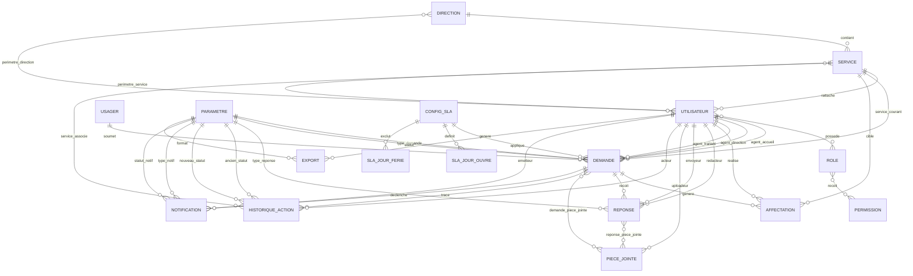

# MCD Simplifie De L Application

Date de mise a jour : 31/03/2026

## Objectif

Ce document donne une lecture plus visuelle et plus metier de la base de donnees.

Il ne remplace pas le document technique :

- [etat-base-de-donnees.md](c:/Suivi-reclamation/docs/base-de-donnees/etat-base-de-donnees.md)

Il sert plutot a comprendre :

- qui sont les acteurs
- quelles sont les grandes entites
- comment elles se relient
- quelles sont les cardinalites principales

## Entites principales

- `Direction`
- `Service`
- `Utilisateur`
- `Role`
- `Permission`
- `Usager`
- `Demande`
- `Reponse`
- `Piece jointe`
- `Historique action`
- `Notification`
- `Export`
- `Configuration SLA`
- `Jour ouvre SLA`
- `Jour ferie SLA`
- `Parametre`

## Lecture metier simple

1. Une `Direction` contient plusieurs `Services`.
2. Un `Service` peut avoir plusieurs `Utilisateurs`.
3. Un `Usager` peut soumettre plusieurs `Demandes`.
4. Une `Demande` appartient a un seul `Usager`.
5. Une `Demande` est typifiee par un `Parametre` de type de demande.
6. Une `Demande` porte un `Statut`, lui aussi stocke dans `Parametre`.
7. Une `Demande` peut etre affectee a un `Service`.
8. Une `Demande` peut etre prise en charge par plusieurs acteurs selon l'etape :
   - accueil
   - chef de service
   - agent traitant
9. Une `Demande` peut produire plusieurs `Reponses`.
10. Une `Demande` genere plusieurs lignes dans `Historique action`.
11. Une `Demande` peut avoir plusieurs `Notifications`.
12. Une `Demande` suit une seule `Configuration SLA`.
13. Une `Configuration SLA` contient plusieurs `Jours ouvres` et plusieurs `Jours feries`.

## Cardinalites metier

### Organisation

- `Direction (1,1) -> Service (0,N)`
- `Service (1,1) -> Utilisateur (0,N)`
- `Utilisateur (0,N) <-> (0,N) Role`
- `Role (0,N) <-> (0,N) Permission`

### Perimetres

- `Utilisateur (0,N) <-> (0,N) Direction`
- `Utilisateur (0,N) <-> (0,N) Service`

### Usagers et demandes

- `Usager (1,1) -> Demande (0,N)`
- `Demande (1,1) -> Reponse (0,N)`
- `Demande (1,1) -> Historique action (0,N)`
- `Demande (1,1) -> Notification (0,N)`
- `Demande (0,N) <-> (0,N) Piece jointe`
- `Reponse (0,N) <-> (0,N) Piece jointe`

### Parametrage

- `Parametre (1,1) -> Demande (0,N)` pour le type
- `Parametre (1,1) -> Demande (0,N)` pour le statut
- `Parametre (1,1) -> Reponse (0,N)` pour le type de reponse
- `Parametre (1,1) -> Notification (0,N)` pour le type et le statut
- `Parametre (1,1) -> Export (0,N)` pour le format

### SLA

- `Configuration SLA (1,1) -> Demande (0,N)`
- `Configuration SLA (1,1) -> Jour ouvre SLA (0,N)`
- `Configuration SLA (1,1) -> Jour ferie SLA (0,N)`

## Schema Mermaid Simplifie



## Vision par blocs

### Bloc 1. Organisation

- `Direction`
- `Service`
- `Utilisateur`
- `Role`
- `Permission`

Ce bloc dit :

- qui appartient a quoi
- qui peut agir
- sur quel perimetre

### Bloc 2. Metier reclamation / information

- `Usager`
- `Demande`
- `Affectation`
- `Reponse`
- `Piece jointe`

Ce bloc dit :

- qui a envoye le mail
- quel dossier a ete cree
- a qui il a ete affecte
- quelle reponse a ete produite
- avec quels documents

### Bloc 3. Suivi et audit

- `Historique action`
- `Notification`
- `Export`

Ce bloc dit :

- qui a fait quoi
- a quel moment
- quels messages ont ete envoyes
- quels exports ont ete generes

### Bloc 4. Delais

- `Configuration SLA`
- `Jour ouvre SLA`
- `Jour ferie SLA`

Ce bloc dit :

- selon quelles regles les delais sont calcules
- sur quels jours et plages horaires
- avec quelles exclusions

## Parcours simplifie d un dossier

```text
Usager
  -> Demande
  -> Affectation accueil / service / agent
  -> Reponse
  -> Notification
  -> Cloture
  -> Historique action a chaque etape
```

## Tables pivots importantes

- `utilisateur_role`
- `permission_role`
- `perimetre_direction`
- `perimetre_service`
- `demande_piece_jointe`
- `reponse_piece_jointe`
- `model_has_roles`
- `model_has_permissions`

## Resume tres court

Le coeur de l application est :

- `Usager`
- `Demande`
- `Service`
- `Utilisateur`
- `Reponse`
- `Historique action`

Et tout le reste sert a :

- organiser
- parametrer
- tracer
- calculer les delais
